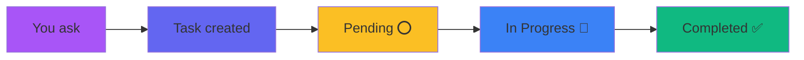
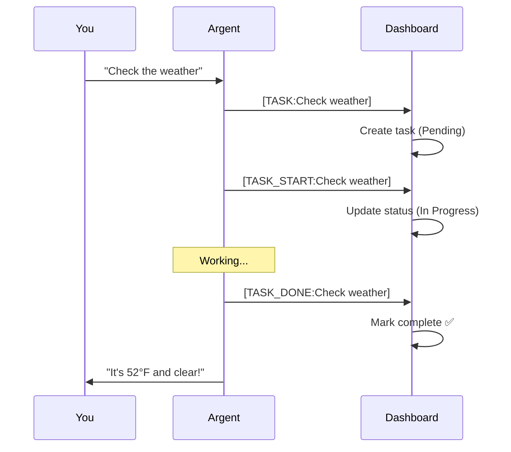
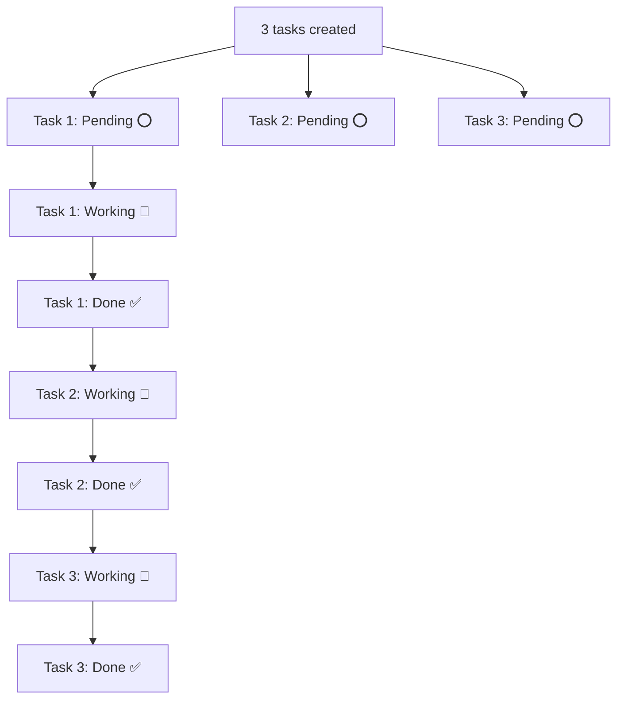
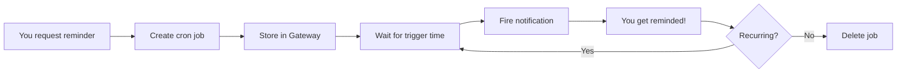

# Task & Schedule System - User Guide

Welcome to the Argent Dashboard task management system! This guide shows you how to create, track, and manage tasks through natural conversation.

---

## Quick Start

**Just ask me to do something.** I'll automatically create a task and show you the progress.

```
You: "Check the weather in Austin"
Me: [Creates task] → "On it! Checking weather..."
```

---

## How Tasks Work

### Task Lifecycle



### Task States

| State           | Icon | Description             | What You See          |
| --------------- | ---- | ----------------------- | --------------------- |
| **Pending**     | ⭕   | Queued, not started     | Gray circle           |
| **In Progress** | 🔄   | Currently working on it | Purple spinning wheel |
| **Completed**   | ✅   | Done!                   | Green checkmark       |
| **Error**       | ❌   | Something went wrong    | Red X                 |

---

## Creating Tasks

### Method 1: Natural Language (Recommended)

Just tell me what you need - I'll figure it out.

**Examples:**

| What You Say                         | Task Created                    |
| ------------------------------------ | ------------------------------- |
| "Check my email"                     | ✅ Check email inbox            |
| "Find the latest silver prices"      | ✅ Fetch silver spot prices     |
| "Remind me about the meeting at 3pm" | ✅ Set reminder for 3pm meeting |
| "Search for restaurants near me"     | ✅ Search nearby restaurants    |

### Method 2: Task Button

1. Click the **+ button** next to Tasks
2. Enter task title and details
3. Hit Enter or click Save

---

## Task Workflow



---

## Multiple Tasks

When you give me several tasks at once, I'll create them all and work through them one by one.

### Example: Multi-Task Request

**You:**

> I have three things for you:
>
> 1. Check the weather
> 2. Look up silver prices
> 3. Find my next calendar event

**What Happens:**



**Task List Shows:**

| #   | Task                     | Status  |
| --- | ------------------------ | ------- |
| 1   | Check weather            | ✅ Done |
| 2   | Look up silver prices    | ✅ Done |
| 3   | Find next calendar event | ✅ Done |

---

## Task Actions

### What You Can Do

| Action           | How                      | Icon |
| ---------------- | ------------------------ | ---- |
| **Execute**      | Click ▶️ play button     | ▶️   |
| **Edit**         | Click ✏️ pencil icon     | ✏️   |
| **Delete**       | Click 🗑️ trash icon      | 🗑️   |
| **View Details** | Click task row to expand | ⓘ    |

### Task Details

Click any task to see:

- Full description
- Created time
- Completion time (if done)
- Execution history
- Any errors or notes

---

## Schedules & Reminders

I can set up recurring tasks and one-time reminders using cron jobs.

### Creating a Reminder

**One-Time:**

```
You: "Remind me in 20 minutes to check the oven"
Me: Creates cron job → fires in 20 min
```

**Recurring:**

```
You: "Every morning at 8am, greet me and show silver prices"
Me: Creates daily cron job → 8am every day
```

### Schedule Examples

| Request                | Schedule Created            |
| ---------------------- | --------------------------- |
| "Remind me at 3pm"     | Today at 3:00 PM (one-time) |
| "Every weekday at 9am" | Mon-Fri 9:00 AM (recurring) |
| "Hourly status check"  | Every hour on the hour      |
| "Daily at noon"        | 12:00 PM every day          |

### Cron Job Workflow



---

## Task vs Schedule

| Feature          | Task               | Schedule/Cron               |
| ---------------- | ------------------ | --------------------------- |
| **Timing**       | Do it now          | Do it later / recurring     |
| **Visibility**   | Shows in task list | Background job              |
| **Notification** | Progress updates   | Fires when scheduled        |
| **Best For**     | Immediate actions  | Reminders, recurring checks |

**Task Example:**

> "Check the weather" → I do it immediately

**Schedule Example:**

> "Remind me at 5pm to leave for meeting" → Fires at 5pm

---

## Behind the Scenes: Task Markers

You don't see these, but here's how I communicate with the dashboard:

### Marker Reference

| Marker               | Purpose          | Example                      |
| -------------------- | ---------------- | ---------------------------- |
| `[TASK:title]`       | Create new task  | `[TASK:Check weather]`       |
| `[TASK_START:title]` | Mark in-progress | `[TASK_START:Check weather]` |
| `[TASK_DONE:title]`  | Mark complete    | `[TASK_DONE:Check weather]`  |
| `[TASK_ERROR:title]` | Mark failed      | `[TASK_ERROR:Check weather]` |

These markers are **invisible** - stripped from what you see in chat.

---

## Advanced Features

### Task Priority

Coming soon! You'll be able to:

- Set high/medium/low priority
- Reorder tasks
- Auto-prioritize urgent items

### Task Categories

Group tasks by type:

- 📧 Email tasks
- 🌦️ Weather checks
- 🥈 Silver price monitoring
- 📅 Calendar items
- 🔧 System maintenance

### Task Templates

Save common task patterns:

- "Morning routine" → weather + calendar + email
- "Market check" → silver prices + market news
- "Daily wrap-up" → task summary + calendar preview

---

## Tips & Best Practices

### ✅ Do This

- Be specific: "Check weather in Austin" vs "weather"
- Give context: "Remind me before the 3pm meeting"
- Check task list to see progress
- Review completed tasks in history

### ❌ Avoid This

- Don't create duplicate tasks (I'll dedupe them)
- Don't click Execute repeatedly (once is enough)
- Don't expect instant results for long tasks

---

## Troubleshooting

### Task Not Appearing?

1. **Refresh the page** - Sometimes hot-reload misses updates
2. **Check you're in dashboard** - Tasks only show when chatting through dashboard
3. **Look in Activity Log** - Errors show there

### Task Stuck In Progress?

- Give it time - some tasks take a minute
- Check Activity Log for errors
- Click task to see details
- If stuck >5 min, delete and recreate

### Lost Tasks?

- Check "Recently Completed" section
- Completed tasks auto-archive after 24 hours
- Use search to find archived tasks

---

## Keyboard Shortcuts

| Key              | Action                    |
| ---------------- | ------------------------- |
| **Ctrl/Cmd + K** | Quick add task            |
| **Ctrl/Cmd + /** | Toggle task list          |
| **Space**        | Start/pause selected task |
| **Delete**       | Delete selected task      |

---

## Integration

### Calendar Integration

Tasks auto-sync with your calendar:

- Meeting reminders become tasks
- Completed tasks can create calendar entries
- Calendar events trigger proactive reminders

### Voice Commands

Just speak naturally:

> "Hey Argent, check the weather"

I'll create the task and get it done!

---

## Summary

**Creating tasks is simple:**

1. Tell me what you need
2. Watch it appear in the task list
3. See the progress (⭕ → 🔄 → ✅)
4. Get the results in chat

**For reminders:**

- One-time: "Remind me at 3pm"
- Recurring: "Every morning at 8am"

**That's it!** The system handles the rest. Just chat naturally and I'll manage the tasks.

---

**Questions?** Ask me anything about tasks or schedules - I'm here to help! 🚀
