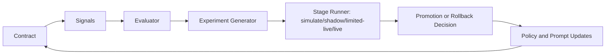
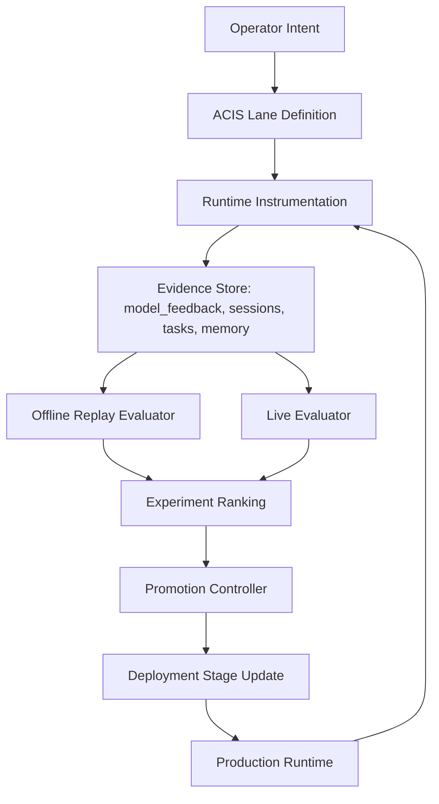
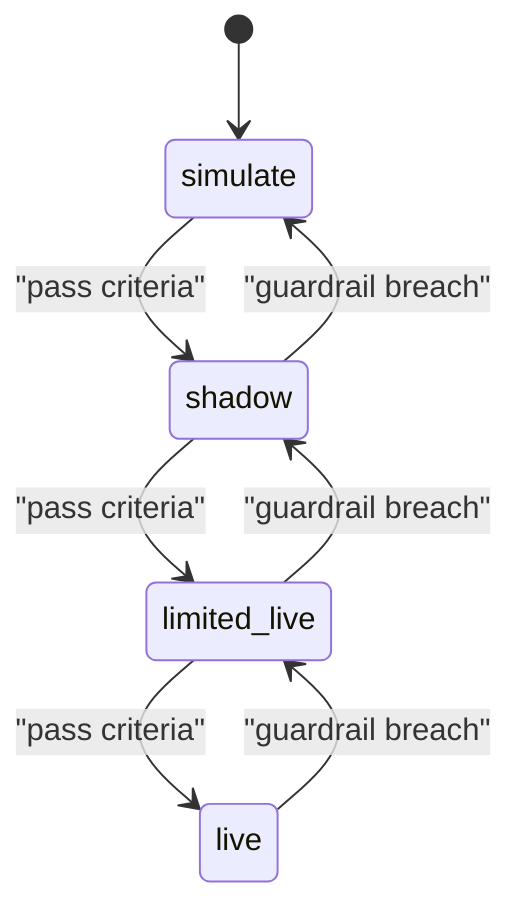

# ACIS: Argent Continuous Improvement System

Status: Draft v0.1  
Scope: Cross-system reliability and improvement framework for ArgentOS  
Primary first lane: `ACIS-CCCI` (continuous command-compliance improvement)

## Thesis

Argent should be treated as a continuously learning control system, not a static prompt + tool wrapper.
Every critical behavior must be defined as a contract, measured with objective signals, stress-tested through experiments, and promoted only when it improves production outcomes without breaking safety or trust.

ACIS is the reusable operating system for that loop.

## Why ACIS Exists

1. Prompt rules alone are not sufficient for reliable execution.
2. One-off fixes decay; enforced loops compound.
3. Reliability must be measurable and promotable by evidence.
4. The same loop should work for command compliance, memory quality, routing quality, workforce execution quality, and support quality.

## ACIS Core Model

Every ACIS lane follows the same seven primitives:

1. `Contract`: what correct behavior means.
2. `Signals`: the telemetry needed to verify behavior.
3. `Evaluator`: scoring logic for success/failure and severity.
4. `Experiment`: candidate policy/guardrail/model variants.
5. `Gate`: thresholds required for promotion.
6. `Promotion`: `simulate -> shadow -> limited-live -> live`.
7. `Rollback`: automatic demotion when guardrails breach.



## System Architecture



## Stage Model



## ACIS Lane Template

Each lane is a capability-specific implementation of ACIS.

```yaml
lane_id: ACIS-CCCI
lane_name: Continuous Command-Compliance Improvement
contract:
  success: "Any side-effect commitment must execute required tool call(s) in same turn."
  failure: "Commitment text without execution evidence."
signals:
  - session transcript events
  - tool call and tool result events
  - model_feedback records
  - user correction follow-ups
primary_metrics:
  - commitment_without_tool_call_rate
  - user_reprompt_due_to_non_execution_rate
guardrails:
  - false_positive_block_rate
  - median_reply_latency
stages:
  - simulate
  - shadow
  - limited-live
  - live
promotion_gates:
  - primary_metrics_improve
  - guardrails_not_worse
rollback_rules:
  - two_consecutive_window_breaches
```

## Reuse Across ArgentOS

| Lane ID        | Domain                | Contract Example                                                           |
| -------------- | --------------------- | -------------------------------------------------------------------------- |
| `ACIS-CCCI`    | Command compliance    | If agent commits action, tool execution evidence must exist.               |
| `ACIS-Memory`  | Recall quality        | Claimed memory facts must map to retrievable evidence in memory index.     |
| `ACIS-Router`  | Model routing quality | Chosen tier must meet quality target at lowest cost for complexity bucket. |
| `ACIS-Worker`  | Execution worker      | Worker must produce evidence-backed progress or auto-block.                |
| `ACIS-Support` | Support quality       | Replies must meet intent/accuracy/escalation policy with bounded latency.  |

## First Implementation Lane: ACIS-CCCI

### Problem Definition

Failure mode: the assistant commits to an action ("I'll file that now") but does not call the tool in that turn.
This is a trust failure even when model capability is high.

### CCCI Contract

1. If assistant text contains a side-effect commitment, execution evidence must appear in the same turn.
2. If required tool execution is missing, response is not production-valid.
3. In chat mode, high-confidence misses are blocked; low-confidence misses are retried with stronger guardrails until resolved or explicitly degraded.

### CCCI Metric Pack

Primary:

1. `commitment_without_tool_call_rate`
2. `commitment_to_execution_latency_ms`
3. `user_reprompt_due_to_non_execution_rate`

Guardrail:

1. `false_positive_block_rate`
2. `median_reply_latency_ms`
3. `tool_call_success_rate`

Diagnostic:

1. by tool family
2. by model and provider
3. by session type (`main`, `heartbeat`, `contemplation`, `subagent`)

### Current Gap Map (Current Code Reality)

1. Claim monitoring currently targets a narrow tool subset in [`src/agents/tool-claim-validation.ts`](../../src/agents/tool-claim-validation.ts).
2. Soft-warning behavior in chat can allow promise text without hard suppression in [`src/agents/pi-embedded-runner/run.ts`](../../src/agents/pi-embedded-runner/run.ts).
3. Existing tests intentionally allow plain future/offer language in [`src/agents/tool-claim-validation.test.ts`](../../src/agents/tool-claim-validation.test.ts), which means commitment-style text can bypass current enforcement.

### CCCI Rollout Plan

Phase 0: Instrumentation baseline

1. Log commitment-classified turns.
2. Log matched/unmatched execution evidence.
3. Record mismatch reason categories in `model_feedback`.

Phase 1: Deterministic contract parser

1. Add commitment-intent detection for side-effect verbs (`create`, `file`, `send`, `post`, `update`, `open`, `schedule`, `delete`).
2. Map commitment intents to required tool families.
3. Validate same-turn execution evidence.

Phase 2: Staged enforcement

1. `simulate`: score only.
2. `shadow`: score plus synthetic block decision.
3. `limited-live`: block high-confidence misses for selected tools.
4. `live`: block all high-confidence misses, retry low-confidence misses.

Phase 3: Self-improving loop

1. Feed mismatch episodes into SIS lesson extraction.
2. Reinforce successful policy variants.
3. Auto-demote regressing variants.

## Operating Cadence

1. Hourly: run lane evaluators and append lane metrics.
2. Daily: rank variants and produce promotion recommendations.
3. Weekly: approve promotions/rollbacks with operator sign-off.
4. Monthly: retire stale variants and refresh lane contracts.

## Promotion and Rollback Policy

Promote only when all are true:

1. Primary metric improves over baseline window.
2. Guardrails remain within limits.
3. No new P0/P1 regressions in sampled transcripts.

Rollback immediately when either is true:

1. Guardrail breach in two consecutive windows.
2. Trust-critical regression (confirmed "say-do" miss on committed action).

## Definition of Done for ACIS Adoption

1. Every critical Argent capability has an ACIS lane ID and contract.
2. Every lane has measurable primary and guardrail metrics.
3. Every lane runs staged promotion, not direct live rollout.
4. Every rollback is policy-driven and automated where possible.
5. Every significant failure produces a reusable lesson.

## Next Step: Start with "No Lip Service"

Immediate execution target is `ACIS-CCCI`:

1. make commitment detection explicit,
2. require same-turn execution evidence for committed side effects,
3. enforce staged promotion before full live blocking,
4. keep false positives bounded with measurable guardrails.

This gives Argent a provable "do what you say" reliability ratchet and establishes the reusable ACIS pattern for all other domains.
