# ArgentOS Memory Architecture v3: Obsidian + Cognee Integration

**Author:** Jason Brashear | **Date:** March 12, 2026  
**Status:** Architecture Specification  
**Depends On:** `argentos_memory_architecture.md` (current), `aos-tools-thesis.md`  
**New Components:** `aos-obsidian`, `aos-cognee`, Cognee SDK, Kuzu graph store

---

## 1. Overview

This document specifies how an Obsidian vault and the Cognee knowledge graph engine integrate into the existing ArgentOS memory architecture. The integration adds a **fourth memory source** - Jason's externalized knowledge - without modifying MemU, SIS, the Knowledge Library, the StorageAdapter bridge, or any existing retrieval logic.

### What Exists (Unchanged)

| System                | Purpose                                              | Storage                   |
| --------------------- | ---------------------------------------------------- | ------------------------- |
| **MemU**              | Episodic memory from conversations and agent actions | PG17 + pgvector (768-dim) |
| **Knowledge Library** | RAG over uploaded documents ("I Know Kung Fu")       | PG17 + pgvector (768-dim) |
| **SIS**               | Self-improving lessons from contemplation cycles     | PG17 (lessons, patterns)  |
| **Redis**             | Hot cache: presence, state, family streams           | Redis (port 6380)         |

### What's New

| Component          | Purpose                                            | Storage                                 |
| ------------------ | -------------------------------------------------- | --------------------------------------- |
| **Obsidian Vault** | Human capture surface for research, notes, specs   | Filesystem (markdown)                   |
| **Cognee**         | Knowledge graph engine - entity extraction + graph | PG17 + pgvector (shared) + Kuzu (graph) |
| **aos-obsidian**   | CLI tool for agent access to vault                 | N/A (reads filesystem)                  |
| **aos-cognee**     | CLI wrapper around Cognee Python SDK               | N/A (calls Cognee library)              |

---

## 2. Architecture Diagram

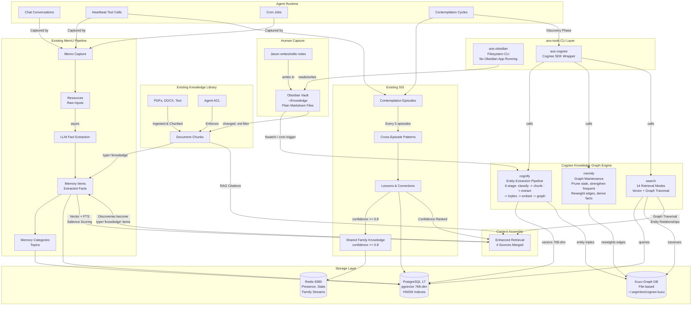

---

## 3. The Four Memory Sources

After integration, Argent's context assembly draws from four distinct sources, each answering a different kind of question:

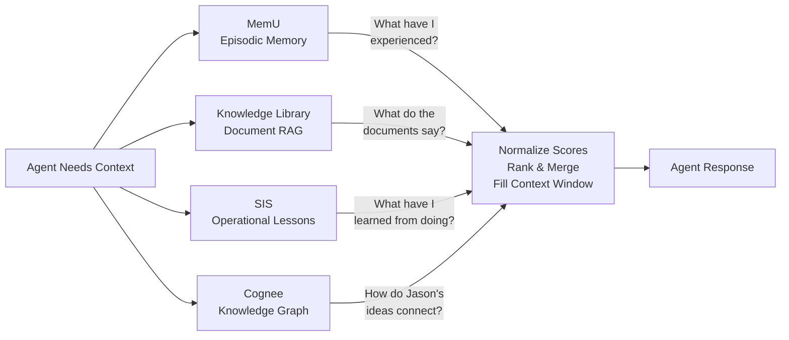

| Source                | Question It Answers                               | Retrieval Method                   | Scoring                                |
| --------------------- | ------------------------------------------------- | ---------------------------------- | -------------------------------------- |
| **MemU**              | "What have I experienced with this person/topic?" | Vector similarity + FTS + salience | cosine × reinforcement × recency_decay |
| **Knowledge Library** | "What do the uploaded documents say?"             | Vector similarity + citations      | cosine similarity, citation-tagged     |
| **SIS**               | "What mistakes/successes relate to this action?"  | FTS + confidence ranking           | confidence score × recency bias        |
| **Cognee** (NEW)      | "How do concepts in Jason's notes connect?"       | Graph traversal + vector hybrid    | Cognee relevance score (14 modes)      |

### Retrieval Priority & Sufficiency

The existing dual retrieval mode extends naturally:

1. **First pass:** MemU vector search + Knowledge Library RAG (existing)
2. **Sufficiency check:** LLM evaluates "Do we have enough context?" (existing)
3. **If insufficient:** FTS keyword search on MemU items (existing)
4. **If still insufficient or query is structural:** Cognee graph search (NEW)
5. **Always:** SIS lessons injected into system prompt (existing)

Cognee graph search is triggered when:

- The sufficiency check fails after vector + keyword search
- The query involves **relationships** between entities ("how does X connect to Y?")
- The agent is in a **contemplation discovery phase**
- The query explicitly references vault content ("check my notes on...")

---

## 4. Cognee Deep Dive

### What Cognee Is

Cognee is an open-source (Apache-2.0) Python SDK that builds knowledge graphs from unstructured data. It is **not** a server. It is a library you call from code. It was built specifically for AI agent memory.

- **GitHub:** `topoteretes/cognee` - 11k stars, 1k forks
- **Funding:** $7.5M seed (Feb 2026), backed by Pebblebed, founders of OpenAI and FAIR
- **Production:** 70+ companies including Bayer, University of Wyoming
- **License:** Apache-2.0 (fully open, no restrictions on commercial use)

### The Three Operations

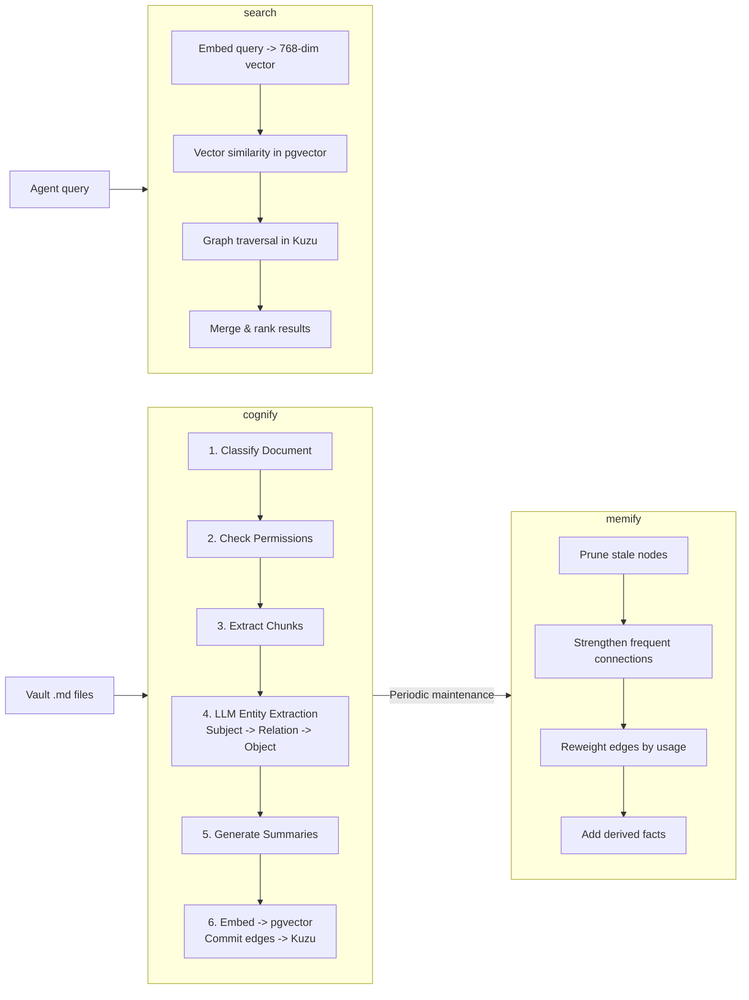

**cognify** reads markdown files and extracts structured knowledge. From a note about Samsung SSB technology, it would produce triples like:

- `(Samsung, develops, solid-state batteries)`
- `(solid-state batteries, require, 1kg silver per unit)`
- `(silver demand, driven_by, EV battery production)`
- `(Samsung, targets_date, 2027 mass production)`

These triples become nodes and edges in the Kuzu graph. The text chunks and entity descriptions get embedded at 768 dimensions and stored in pgvector - the same pgvector instance and dimension count as MemU.

**memify** maintains the graph over time. Like MemU's significance hierarchy where core memories never decay and routine ones fade, memify strengthens frequently-traversed edges and prunes nodes that haven't been accessed. The graph gets sharper between queries.

**search** queries across both vector (pgvector) and graph (Kuzu) simultaneously. Cognee ships 14 retrieval modes:

| Mode               | Description                      | Best For                      |
| ------------------ | -------------------------------- | ----------------------------- |
| `SIMILARITY`       | Pure vector cosine search        | Simple "find similar" queries |
| `GRAPH_COMPLETION` | LLM reasoning with graph context | "How does X relate to Y?"     |
| `CHUNKS`           | Return source text chunks        | Need exact source material    |
| `SUMMARIES`        | Return entity/document summaries | Quick overviews               |
| `INSIGHTS`         | Chain-of-thought graph traversal | Complex multi-hop reasoning   |

For ArgentOS, `GRAPH_COMPLETION` and `INSIGHTS` are the primary modes - they answer the structural questions that vector search alone cannot.

### Storage Configuration

Cognee uses three storage backends, all of which map to existing ArgentOS infrastructure:

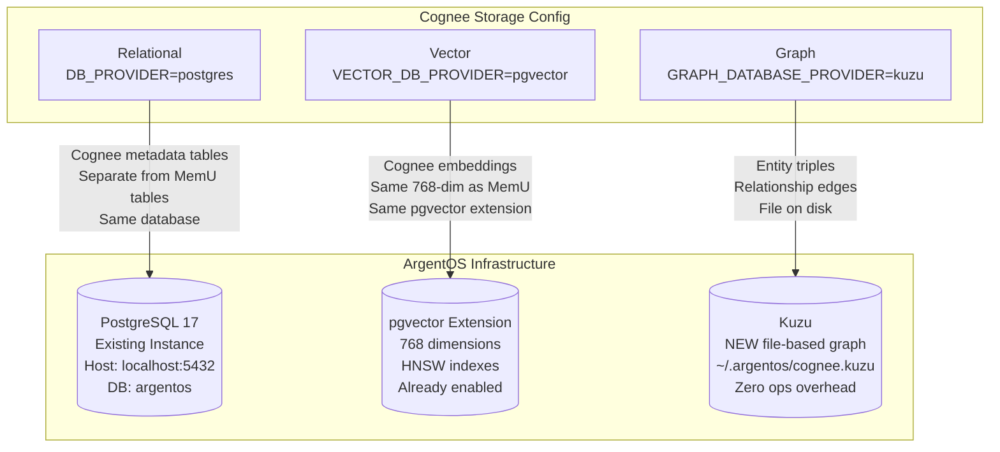

**Critical detail:** Cognee creates its own tables (`cognee_*` prefix) in the same PostgreSQL database. MemU tables, Knowledge Library tables, SIS tables, and Cognee tables coexist with zero schema conflicts. No migration to existing tables. No new database instance.

### Environment Configuration

```bash
# Cognee points at existing ArgentOS PostgreSQL
DB_PROVIDER=postgres
DB_HOST=localhost
DB_PORT=5432
DB_NAME=argentos
DB_USERNAME=argent
DB_PASSWORD=${ARGENT_DB_PASSWORD}

# Use existing pgvector - MUST match 768-dim
VECTOR_DB_PROVIDER=pgvector

# Graph layer - Kuzu is file-based, zero configuration
GRAPH_DATABASE_PROVIDER=kuzu
# Kuzu stores graph data here:
# ~/.argentos/cognee.kuzu/

# Embedding model - MUST produce 768-dim to match existing setup
# Option A: Local model via Ollama (free, on Dell server)
EMBEDDING_MODEL=nomic-embed-text

# Option B: API model (if using OpenAI text-embedding-3-small,
# configure dimensions=768 to match)

# LLM for entity extraction (cognify stage 4)
LLM_PROVIDER=anthropic  # or openai, ollama
LLM_MODEL=claude-sonnet-4-20250514
LLM_API_KEY=${ANTHROPIC_API_KEY}
```

---

## 5. The Obsidian Vault

### What It Is

A directory of plain markdown files. That's it. No database, no server, no application required. Obsidian (the app) is an optional UI for when Jason wants to browse and edit notes visually. The agents never touch the Obsidian application.

```
~/Knowledge/
├── Daily/
│   ├── 2026-03-12.md
│   └── 2026-03-11.md
├── Projects/
│   ├── ArgentOS/
│   │   ├── Architecture.md
│   │   ├── MemU Design.md
│   │   └── MAO Stability.md
│   ├── Floq/
│   ├── HoLaCe/
│   ├── PayPunch/
│   ├── Silver Intel Report/
│   │   ├── Samsung SSB Thesis.md
│   │   ├── China Export Restrictions.md
│   │   └── Miner Positions.md
│   └── TC Protect/
├── Research/
│   ├── Cognee Integration.md
│   ├── CLI-Anything Harness.md
│   └── Personal Knowledge Graphs.md
├── Clients/
│   ├── Sun-Tech Electric/
│   └── Titanium Computing/
├── Infrastructure/
│   ├── MikroTik Config.md
│   ├── Dell Server Setup.md
│   └── DGX Sparks.md
├── Writing/
│   ├── Frontier Operations Series/
│   └── Medium Drafts/
└── Templates/
    ├── daily.md
    ├── project.md
    └── meeting.md
```

### How Agents Access It

Via `aos-obsidian` - a CLI tool from the `aos-tools` ecosystem. No MCP server. No running Obsidian. No WebSocket. Direct filesystem operations.

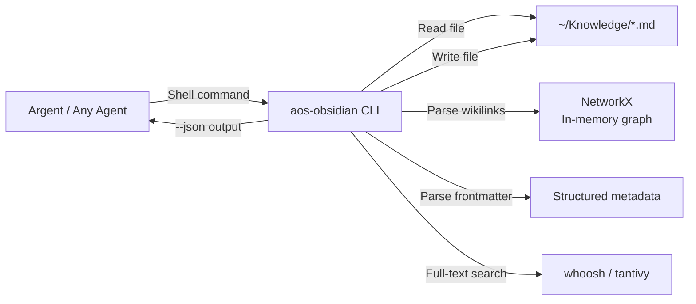

Permission modes (enforced by `aos-obsidian --mode`):

| Mode       | Read notes | Search | Graph traverse | Create notes | Edit notes | Delete notes |
| ---------- | ---------- | ------ | -------------- | ------------ | ---------- | ------------ |
| `readonly` | ✅         | ✅     | ✅             | ❌           | ❌         | ❌           |
| `write`    | ✅         | ✅     | ✅             | ✅           | ✅         | ❌           |
| `full`     | ✅         | ✅     | ✅             | ✅           | ✅         | ✅           |

---

## 6. Data Flow: End to End

### Flow 1: Jason Writes a Note -> Cognee Processes -> Agent Retrieves

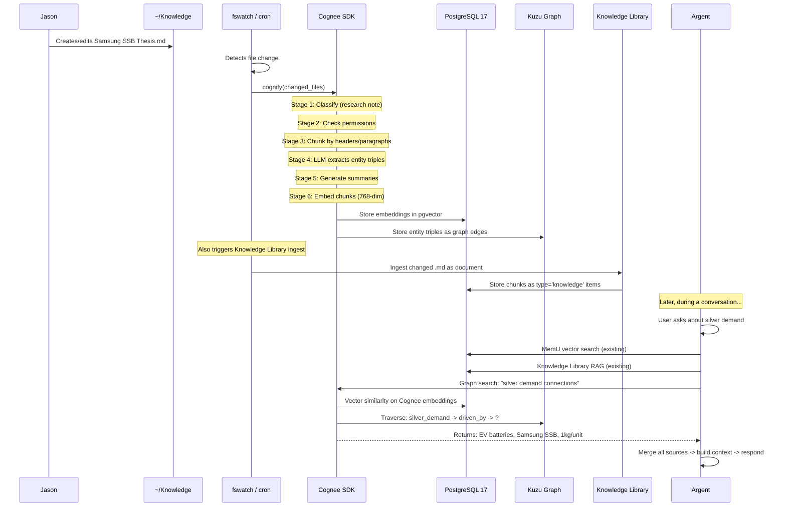

### Flow 2: Contemplation Discovery -> Cross-Pollination

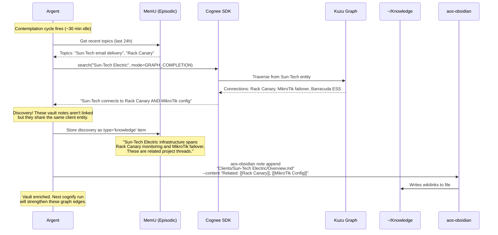

### Flow 3: Multi-Agent with ACL

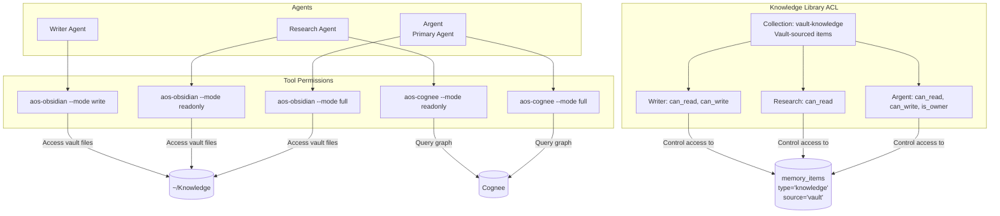

---

## 7. Database Schema Additions

### Cognee Tables (Auto-Created by Cognee SDK)

Cognee creates its own tables when you first run `cognify`. These live alongside existing MemU/SIS tables in the same `argentos` database. No manual schema creation needed.

Key Cognee tables (created automatically):

- `cognee_documents` - Ingested document metadata
- `cognee_chunks` - Document chunks with embeddings
- `cognee_entities` - Extracted entities (nodes)
- `cognee_relationships` - Entity relationships (edges, mirrored from Kuzu)
- `cognee_pipelines` - Pipeline run history and state

### Knowledge Library Extension for Vault Items

One small addition to the existing Knowledge Library: a new collection for vault-sourced items, and a `source` marker to distinguish them from manually uploaded documents.

```sql
-- Create a vault knowledge collection
INSERT INTO knowledge_collections (id, name, description)
VALUES (gen_random_uuid(), 'vault-knowledge', 'Auto-ingested from Obsidian vault');

-- Vault items get a source flag in the extra JSONB field
-- When ingesting vault .md files through Knowledge Library:
INSERT INTO memory_items (
    id, resource_id, memory_type, summary, embedding,
    content_hash, extra, created_at
) VALUES (
    gen_random_uuid(),
    :resource_id,
    'knowledge',
    :chunk_text,
    :embedding_768,
    :sha256_hash,
    '{"source": "vault", "vault_path": "Projects/Silver Intel Report/Samsung SSB Thesis.md", "chunk_index": 3}'::jsonb,
    now()
);
```

This means vault knowledge items flow through the exact same retrieval pipeline as all other Memory Items - salience scoring, reinforcement, recency decay all apply. Frequently-accessed vault knowledge bubbles to the top just like frequently-reinforced conversation memories.

---

## 8. Embedding Alignment

All systems MUST produce 768-dimension vectors. This is non-negotiable for cross-system retrieval.

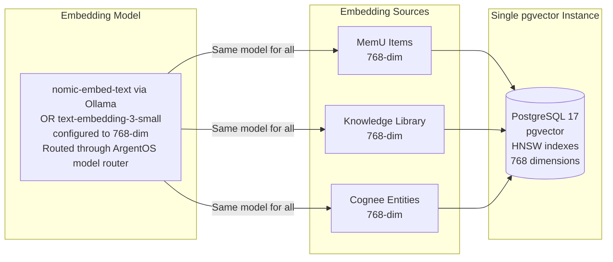

**Configuration requirement:** If using OpenAI's `text-embedding-3-small` (which defaults to 1536), you MUST configure `dimensions=768` in both the ArgentOS model router AND Cognee's embedding config. If using `nomic-embed-text` via Ollama, it natively produces 768 dimensions.

All embeddings must go through the same model to ensure vector spaces are comparable. You cannot mix `nomic-embed-text` vectors with `text-embedding-3-small` vectors in the same pgvector index - cosine similarity becomes meaningless across different embedding spaces.

---

## 9. The Vault Ingestion Pipeline

Two parallel paths process vault changes. Both trigger on the same file change event.

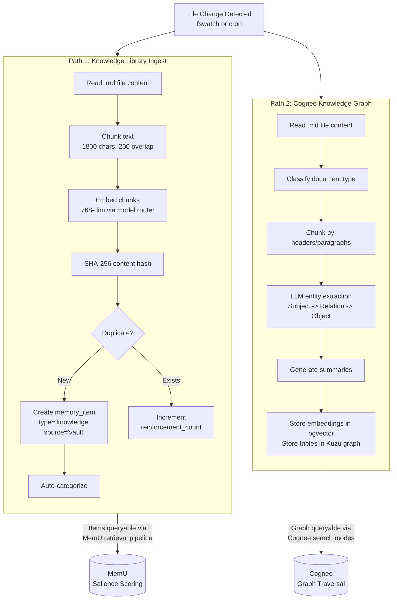

**Why two paths?** They serve different retrieval strategies:

- **Path 1** (Knowledge Library) makes vault content available through the existing MemU retrieval pipeline - salience scoring, reinforcement, recency decay, ACL enforcement. This is how vault content shows up in `memory_recall` and auto-injection.
- **Path 2** (Cognee) builds the relationship graph that enables structural queries - "how does X connect to Y?" This is what powers the contemplation discovery phase and the graph traversal retrieval mode.

Both paths are **incremental**. Only changed files get reprocessed. Content hashing (Path 1) and Cognee's built-in change detection (Path 2) prevent redundant work.

---

## 10. Contemplation Cycle Enhancement

The existing contemplation cycle (fire every ~30min idle, consolidate every 5 episodes) gains a new **discovery phase** that runs after the existing self-reflection.

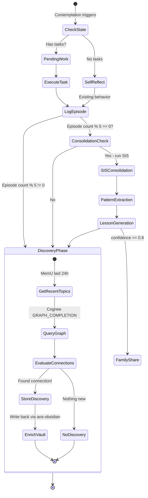

### Discovery Phase Implementation

```typescript
// Added to contemplation cycle, runs after existing self-reflection
async function discoveryPhase(): Promise<void> {
  // 1. Get what Argent has been thinking about recently
  const recentTopics = await memu.retrieve({
    query: "recent topics and conversations",
    topK: 10,
    scoring: "salience",
    minAge: 0,
    maxAge: 24 * 60 * 60 * 1000, // last 24 hours
  });

  // 2. For each topic, ask Cognee if the vault has related knowledge
  for (const topic of recentTopics.slice(0, 3)) {
    // top 3 to limit LLM calls
    const graphResults = await aosCognee.search({
      query: topic.summary,
      mode: "GRAPH_COMPLETION",
      topK: 5,
    });

    // 3. Check if any graph connections are NEW to Argent
    // (not already in MemU as a memory item)
    for (const result of graphResults) {
      const existing = await memu.retrieve({
        query: result.entity + " " + result.relationship,
        topK: 1,
        minSimilarity: 0.92, // high threshold = exact match
      });

      if (existing.length === 0) {
        // 4. This is a genuine discovery - store it
        await memu.store({
          type: "knowledge",
          summary: `Vault discovery: ${topic.summary} connects to ${result.entity} via ${result.relationship}`,
          significance: "medium",
          extra: {
            source: "contemplation_discovery",
            vault_entities: result.entities,
            graph_path: result.traversalPath,
          },
        });

        // 5. Optionally enrich the vault with the connection
        await aosObsidian.appendNote({
          path: result.sourceVaultPath,
          content: `\n\n> [!note] Argent Discovery (${new Date().toISOString().split("T")[0]})\n> Related: [[${result.connectedNote}]] - connected via ${result.relationship}`,
        });
      }
    }
  }
}
```

---

## 11. Implementation Phases

### Phase 1: Vault Setup & aos-obsidian (Days 1-3)

- [ ] Create vault directory structure at `~/Knowledge`
- [ ] Migrate existing project docs, specs, research notes into vault as markdown
- [ ] Install Obsidian app (optional, for human browsing)
- [ ] Complete `aos-obsidian` CLI build (already scaffolded in aos-tools)
  - [ ] `note read`, `note list`, `note search`, `note create`, `note append`
  - [ ] `graph neighbors`, `graph orphans`, `graph hubs`
  - [ ] `frontmatter get`, `frontmatter set`, `frontmatter query`
  - [ ] `--mode` permission enforcement
  - [ ] `--json` output on all commands
- [ ] Unit tests for all aos-obsidian commands

### Phase 2: Cognee Installation & Configuration (Days 4-5)

- [ ] `pip install cognee` on Dell server
- [ ] Configure Cognee env vars to point at existing PG17 + pgvector
- [ ] Configure Cognee to use 768-dim embeddings (match existing)
- [ ] Configure Kuzu graph store at `~/.argentos/cognee.kuzu`
- [ ] Test basic cognify: feed 5-10 vault notes, verify tables created in PG
- [ ] Test search: query the graph, verify entity triples returned
- [ ] Build `aos-cognee` CLI wrapper
  - [ ] `aos-cognee cognify [path]` - run cognify on vault or specific files
  - [ ] `aos-cognee memify` - run graph maintenance
  - [ ] `aos-cognee search [query] --mode [mode] --json` - query the graph
  - [ ] `--mode` permission enforcement (readonly = search only, write = cognify + search)
- [ ] Unit tests for aos-cognee

### Phase 3: Vault -> Knowledge Library Ingestion (Days 6-7)

- [ ] Build vault file watcher (fswatch or cron-based)
- [ ] Wire changed `.md` files into existing Knowledge Library ingestion pipeline
- [ ] Create `vault-knowledge` collection with ACL grants
- [ ] Tag vault items with `extra.source = 'vault'` and `extra.vault_path`
- [ ] Verify vault content appears in `memory_recall` searches
- [ ] Verify dedup works: edit a note, check reinforcement increments
- [ ] Test ACL: research-agent (readonly) can search vault items, cannot write

### Phase 4: Cognee as Retrieval Source (Days 8-10)

- [ ] Add Cognee search as fourth retrieval source in context assembly
- [ ] Wire sufficiency check to trigger Cognee when vector + FTS insufficient
- [ ] Add structural query detection (queries about relationships trigger Cognee)
- [ ] Normalize Cognee relevance scores against MemU salience scores for merging
- [ ] Test: ask Argent a structural question, verify graph traversal fires
- [ ] Test: ask Argent a simple factual question, verify Cognee NOT triggered (efficiency)

### Phase 5: Contemplation Discovery (Days 11-12)

- [ ] Implement discovery phase in contemplation cycle
- [ ] Wire to Cognee graph search for cross-topic connections
- [ ] Wire discoveries to MemU store (type='knowledge', source='contemplation_discovery')
- [ ] Wire vault enrichment via `aos-obsidian note append`
- [ ] Test: seed vault with notes that share implicit connections, verify Argent discovers them
- [ ] Monitor: ensure discovery phase doesn't slow contemplation cycle (budget: <10s)

### Phase 6: Full Integration Testing (Days 13-14)

- [ ] End-to-end: Jason writes note -> Cognee processes -> Argent retrieves in conversation
- [ ] End-to-end: Contemplation discovers connection -> stores in MemU -> enriches vault
- [ ] Multi-agent: Research agent queries vault (readonly), Writer agent creates notes (write)
- [ ] Performance: measure retrieval latency with 4 sources vs current 3
- [ ] Stress test: 1000+ vault notes, verify Cognee cognify incremental performance
- [ ] Verify: no regression in existing MemU retrieval quality
- [ ] Verify: no regression in SIS contemplation cycle timing
- [ ] Verify: Redis presence/state/streams unaffected

---

## 12. Configuration Additions

Add to `argent.json`:

```json
{
  "memory": {
    "existing_config": "unchanged",

    "vault": {
      "enabled": true,
      "path": "~/Knowledge",
      "watchMode": "cron",
      "watchInterval": "5m",
      "ingestToKnowledgeLibrary": true,
      "knowledgeCollection": "vault-knowledge",
      "excludePaths": [".obsidian", ".trash", "Templates"]
    },

    "cognee": {
      "enabled": true,
      "graphStorePath": "~/.argentos/cognee.kuzu",
      "cognifyOnVaultChange": true,
      "memifyInterval": "6h",
      "searchModes": ["GRAPH_COMPLETION", "INSIGHTS", "SIMILARITY"],
      "maxResultsPerQuery": 10,
      "embeddingModel": "nomic-embed-text",
      "embeddingDimensions": 768,
      "extractionModel": "claude-sonnet-4-20250514",
      "triggerOnSufficiencyFail": true,
      "triggerOnStructuralQuery": true
    },

    "contemplation": {
      "existing_config": "unchanged",
      "discoveryPhase": {
        "enabled": true,
        "maxTopics": 3,
        "maxGraphQueriesPerCycle": 3,
        "enrichVault": true,
        "timeBudgetMs": 10000
      }
    }
  }
}
```

---

## 13. What Does NOT Change

This section exists to be explicit about what the integration does NOT touch.

| Component                  | Status            | Notes                                                             |
| -------------------------- | ----------------- | ----------------------------------------------------------------- |
| MemU extraction pipeline   | **Unchanged**     | Resources -> Items -> Categories flow is identical                |
| MemU salience scoring      | **Unchanged**     | cosine × reinforcement × recency_decay                            |
| MemU memory types          | **Unchanged**     | profile, event, knowledge, behavior, skill, tool, self, episode   |
| Knowledge Library chunking | **Unchanged**     | 1800 chars, 200 overlap, citation tags                            |
| Knowledge Library ACL      | **Unchanged**     | collection_grants table, agent-level read/write/owner             |
| SIS feedback loop          | **Unchanged**     | action -> outcome -> evaluation -> lesson                         |
| SIS consolidation          | **Unchanged**     | Every 5 episodes, pattern extraction, lesson generation           |
| SIS family sharing         | **Unchanged**     | confidence >= 0.8 -> Redis Streams -> family agents               |
| StorageAdapter bridge      | **Unchanged**     | DualAdapter, PgAdapter, SQLiteAdapter                             |
| Redis                      | **Unchanged**     | Presence, state, family streams on port 6380                      |
| PG17 schema                | **Unchanged**     | Cognee creates its own tables, no migration needed                |
| pgvector indexes           | **Unchanged**     | Existing HNSW indexes on memory_items unaffected                  |
| Embedding dimensions       | **Unchanged**     | 768-dim across the board                                          |
| Agent tools                | **Extended only** | `memory_recall` gains optional Cognee source, no breaking changes |

---

## 14. Risks & Mitigations

| Risk                                           | Likelihood | Impact | Mitigation                                                                 |
| ---------------------------------------------- | ---------- | ------ | -------------------------------------------------------------------------- |
| Cognee tables conflict with existing PG schema | Low        | High   | Cognee uses `cognee_` prefixed tables; test in staging first               |
| Embedding dimension mismatch                   | Medium     | High   | Enforce 768-dim in Cognee config; add startup validation check             |
| Cognee cognify is slow on large vault          | Medium     | Low    | Incremental processing (only changed files); run on Dell server (72 cores) |
| Discovery phase slows contemplation            | Low        | Medium | Time budget of 10s; skip if budget exceeded                                |
| Kuzu graph file grows large                    | Low        | Low    | Kuzu handles millions of edges; periodic memify prunes stale nodes         |
| LLM costs for entity extraction                | Medium     | Low    | Use local model (Ollama) for extraction; Cognee supports Ollama natively   |
| Vault notes contain sensitive data             | Medium     | Medium | ACL on vault-knowledge collection; exclude paths in config                 |

---

## 15. Success Criteria

The integration is complete when:

1. **Jason can write a note in the vault and Argent can reference it in conversation within 5 minutes** - without Jason pasting the content into chat.

2. **Argent can answer structural questions** - "How does my Samsung SSB thesis connect to my silver miner positions?" - by traversing the Cognee knowledge graph, not just finding similar text.

3. **Contemplation cycles produce genuine discoveries** - connections between vault notes that Jason didn't explicitly create, stored as MemU items and written back to the vault as wikilinks.

4. **No regression in existing memory performance** - MemU retrieval latency, SIS consolidation timing, and Redis responsiveness are unchanged.

5. **Multi-agent access works with ACL** - Research agent can search vault knowledge (readonly), Writer agent can create vault notes (write), Argent has full access.

---

_This document extends `argentos_memory_architecture.md`. The existing architecture remains the foundation. Obsidian + Cognee add a new dimension - not replacing what Argent remembers, but giving her access to what Jason knows._
